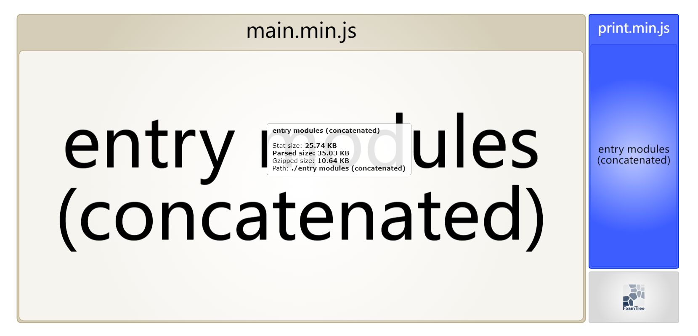
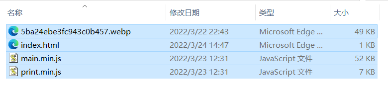
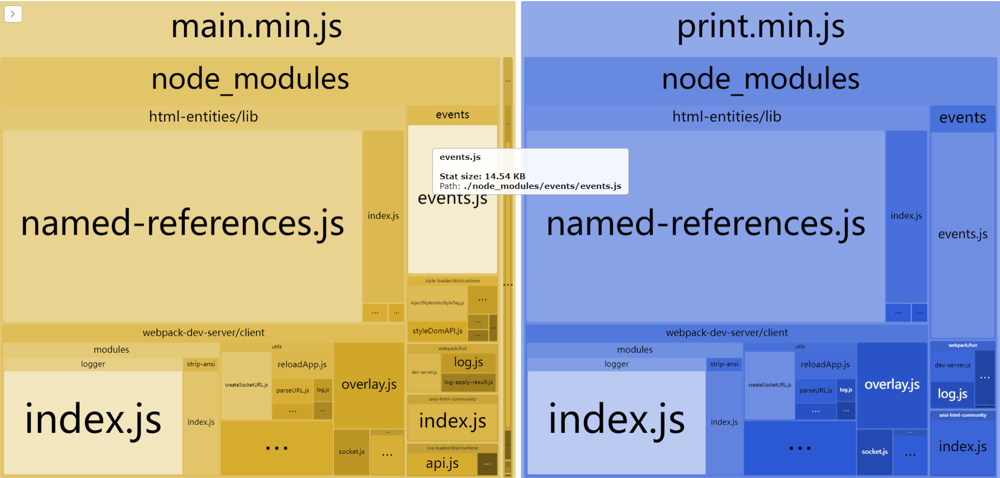

## webpack continue

---
#### 多入口

有时候我们使用webpack打包并不只使用一个入口，而是使用多个入口，这个时候就需要进行相应的配置。

```javascript
// webpack.config.js
const path = require("path")

const config = {
    // entry:"./src/index.js",
    entry:{ // 使用Object来配置多入口
        main:"./index.js",
        print:"./print.js"
    },
    output: {
        // filename:"main.min.js",
        filename:"[name].min.js", // 使用占位符来配置输出文件的文件名
        path:path.resolve(__dirname,"dist")
    },
    ...
}

module.exports = config

```

如上进行配置，将**entry**改写为object，**filename**使用有占位符([name])的string, **[name]** 在最终打包的时候，最终将被替换为对应于object的key值。

---
#### 使用HtmlWebpackPlugin

在上面的例子中，使用多入口文件来对js进行打包，同时我们还需要在<b>./dist/index.html</b>中将生成的js文件手动进行引入，这种方式极不方便，且过于耦合，一旦我们更改配置文件的输出文件名，就需要在<b>./dist/index.html</b>中同步进行修改，为了解决这个问题，我们可以使用HtmlWebpackPlugin。

1. 首先引入依赖 **html-webpack-plugin**
```bash
npm i html-webpack-plugin -S
```

2. 在配置文件 **webpack.config.js** 中进行相关的配置

```javascript
// webpack.config.js
const path = require("path")
const HtmlWebpackPlugin = require("html-webpack-plugin") // 引入 HtmlWebpackPlugin

const config = {
    ...
    // 在plugins中使用HtmlWebpackPlugin
    plugins:[
        new HtmlWebpackPlugin({
            title:"hello webpack", // 对应于生成的html的标题
        })
    ]
}

module.exports = config
```
使用HtmlWebpackPlugin将会自动生成index.html文件，并将打包的资源（js,图片，css等）自动引入该html网页中。

---
#### 清理./dist文件夹

每次 **npm run build**,都会在 <b>./dist</b> 文件夹下面生成打包后的文件。这样多次打包后的 <b>./dist</b> 文件夹下面就会很混乱，或许还会存在我们不需要的文件。最佳实战是每次打包前都清除 <b>./dist</b> 文件夹下面的内容。


在 **webpack@5.20.0以后的版本**， 在配置文件下添加以下内容即可实现。


```javascript
// webpack.config.js
const path = require("path")
const HtmlWebpackPlugin = require("html-webpack-plugin")

const config = {
    ...
    output: {
        // filename:"main.min.js",
        filename:"[name].min.js",
        path:path.resolve(__dirname,"dist"),
        clean:true // 简单的一句，即可实现每次打包前清除./dist文件夹下的文件。
    },
    ...
}

module.exports = config

```

可以在 <b>./dist</b> 文件夹下创建一些无关的文件，再次打包，可以看见 <b>./dist</b> 文件夹下创建的无关文件被删除了。

如果是webpack@5.20.0 以前的版本，如上配置将会报错
```bash
# webpack@5.19.0
G:\data\work\webpack\webpack_continue>npm run build

> webpack-demo@1.0.0 build
> webpack

[webpack-cli] Invalid configuration object. Webpack has been initialized using a configuration object that does not match the API schema.
 - configuration.output has an unknown property 'clean'. These properties are valid:
   object { assetModuleFilename?, auxiliaryComment?, charset?, chunkFilename?, chunkFormat?, chunkLoadTimeout?, chunkLoading?, chunkLoadingGlobal?, compareBeforeEmit?, crossOriginLoading?, devtoolFallbackModuleFilenameTemplate?, devtoolModuleFilenameTemplate?, devtoolNamespace?, enabledChunkLoadingTypes?, enabledLibraryTypes?, enabledWasmLoadingTypes?, environment?, filename?, globalObject?, hashDigest?, hashDigestLength?, hashFunction?, hashSalt?, hotUpdateChunkFilename?, hotUpdateGlobal?, hotUpdateMainFilename?, iife?, importFunctionName?, importMetaName?, library?, libraryExport?, libraryTarget?, module?, path?, pathinfo?, publicPath?, scriptType?, sourceMapFilename?, sourcePrefix?, strictModuleExceptionHandling?, umdNamedDefine?, uniqueName?, wasmLoading?, webassemblyModuleFilename?, workerChunkLoading?, workerWasmLoading? }
   -> Options affecting the output of the compilation. `output` options tell webpack how to write the compiled files to disk.
```

从上面的报错中可以看到：

 **configuration.output has an unknown property 'clean'**

未知的属性 **clean**,表示webpack并不认识该属性。对 **webpack@5.20.0** 以前的版本，正确的清理 **./dist** 的姿势应该是使用 **clean-webpack-plugin** 。

首先引入 **clean-webpack-plugin**:

```bash
npm i clean-webpack-plugin -D
```

接着在webpack.config.js中进行配置使用

```javascript
// webpack.config.js
...
const { CleanWebpackPlugin } = require("clean-webpack-plugin") // 引入 clean-webpack-plugin

const config = {
  ...
    plugins:[
      ...
      new CleanWebpackPlugin(), // 在plugins中使用CleanWebpackPlugin
    ]
}

module.exports = config

```

---
## 使用正确的姿势来进行开发

在开发环境中，常常需要做以下的一些配置以便于我们进行更好的开发。

---
#### 使用Source Map

> 当 webpack 打包源代码时，可能会很难追踪到 error(错误) 和 warning(警告) 在源代码中的原始位置。

虽然浏览器中会将错误（ **error** ）或者警告( **warning** )打印出来，但是仅显示错误出现在打包后的文件中的哪个位置，但对我们来说，对错误进行追踪是没有丝毫用处。

> 为了更容易地追踪 error 和 warning，JavaScript 提供了 source maps 功能，可以将编译后的代码映射回原始源代码.source map 会明确的告诉你错误出现在哪一个文件，哪一行。

手动引入一个错误
```javascript
// ./js/error.js
console.log("hello webpack")
conosle.error("something error") // 此处手动引入错误
```

打包后执行：
```
print.min.js:1 
    something error                       
905 @ print.min.js:1
```

仅显示打包后的错误位置，并不能准确定位错误文件。

在配置文件中使用 source map

```javascript
// webpack.config.js
const path = require("path")
const HtmlWebpackPlugin = require("html-webpack-plugin")

const config = {
    ... 
    devtool:"inline-source-map", // 使用source map，更好的定位错误
    ...
}

module.exports = config

```

打包后再次在浏览器中打开html

```
error.js:1 
        
       something error
905 @ error.js:1
o @ bootstrap:19
(匿名) @ print.min.js:1
(匿名) @ print.min.js:1
(匿名) @ print.min.js:1
```

浏览器控制台准确给出错误在哪个文件（error.js）以及在哪一行（1）。


---
#### 使用 webpack-dev-server

每次我们编写了一部分功能后，都要重新打包并打开html文件来查看是否达到自己想要的效果，并对此进行修正。每次都要打包十分不便，于是乎我们就可以使用**webpack-dev-server**，**webpack-dev-server** 为我们提供了一个基本的 **web server**，并且具有 **live reloading**(实时重新加载) 功能。

首先我们需要引入 **webpack-dev-server**
```bash
npm i webpack-dev-server -S
```

然后在配置文件中进行相关的配置：
```javascript
// webpack.config.js
...

const config = {
    ...
    devServer:{
        static:"./dist", //devServer,将./dist文件作为静态文件部分发布出去。 
    },
    ...
}

...

```

在 **package.json** 中添加运行脚本
```json
{
  ...
  "scripts": {
    ...
    "serve": "webpack serve --open" // 添加这一句
  },
  ...
}

```

开始运行 **npm run serve**

```bash
> webpack-demo@1.0.0 serve C:\Users\17947\Desktop\webpackDemo
> webpack serve --open

<i> [webpack-dev-server] Project is running at:
<i> [webpack-dev-server] Loopback: http://localhost:8080/
<i> [webpack-dev-server] On Your Network (IPv4): http://172.27.74.63:8080/
<i> [webpack-dev-server] On Your Network (IPv6): http://[fe80::c489:a5c7:2749:9a02]:8080/
<i> [webpack-dev-server] Content not from webpack is served from './dist' directory
<i> [webpack-dev-middleware] wait until bundle finished: /
assets by status 1.09 MiB [big]
  asset main.min.js 577 KiB [emitted] [minimized] [big] (name: main) 1 related asset
  asset print.min.js 543 KiB [emitted] [minimized] [big] (name: print) 1 related asset
asset 5ba24ebe3fc943c0b457.webp 48.2 KiB [emitted] [immutable] [from: src/image/gao.webp] (auxiliary name: main)
asset index.html 270 bytes [emitted]
runtime modules 54 KiB 24 modules
orphan modules 17.2 KiB [orphan] 7 modules
cacheable modules 174 KiB (javascript) 48.2 KiB (asset)
  modules by path ./node_modules/ 170 KiB 23 modules
  modules by path ./src/ 4.37 KiB (javascript) 48.2 KiB (asset)
    modules by path ./src/*.js 404 bytes 2 modules
    modules by path ./src/css/*.css 3.75 KiB 2 modules
    modules by path ./src/js/*.js 189 bytes 2 modules
    ./src/image/gao.webp 42 bytes (javascript) 48.2 KiB (asset) [built] [code generated]

WARNING in configuration
The 'mode' option has not been set, webpack will fallback to 'production' for this value.
Set 'mode' option to 'development' or 'production' to enable defaults for each environment.
You can also set it to 'none' to disable any default behavior. Learn more: https://webpack.js.org/configuration/mode/

WARNING in asset size limit: The following asset(s) exceed the recommended size limit (244 KiB).
This can impact web performance.
Assets:
  main.min.js (577 KiB)
  print.min.js (543 KiB)

WARNING in entrypoint size limit: The following entrypoint(s) combined asset size exceeds the recommended limit (244 KiB). This can impact web performance.
Entrypoints:
  main (577 KiB)
      main.min.js
  print (543 KiB)
      print.min.js


WARNING in webpack performance recommendations: 
You can limit the size of your bundles by using import() or require.ensure to lazy load some parts of your application.
For more info visit https://webpack.js.org/guides/code-splitting/

webpack 5.70.0 compiled with 4 warnings in 5543 ms

```

当我们修改相关的文件，webpack-dev-server就会自动打包构建。

---
### 使用webpack-dev-server

在上一个节点中，成功使用webpack-dev-server来对文件进行自动打包构建，但同时也出现了一些警告（warning）

```bash
Compiled with problems:

WARNING

configuration
The 'mode' option has not been set, webpack will fallback to 'production' for this value.
Set 'mode' option to 'development' or 'production' to enable defaults for each environment.
You can also set it to 'none' to disable any default behavior. Learn more: https://webpack.js.org/configuration/mode/


WARNING

asset size limit: The following asset(s) exceed the recommended size limit (244 KiB).
This can impact web performance.
Assets: 
  main.min.js (577 KiB)
  print.min.js (543 KiB)


WARNING

entrypoint size limit: The following entrypoint(s) combined asset size exceeds the recommended limit (244 KiB). This can impact web performance.
Entrypoints:
  main (577 KiB)
      main.min.js
  print (543 KiB)
      print.min.js


WARNING

webpack performance recommendations: 
You can limit the size of your bundles by using import() or require.ensure to lazy load some parts of your application.
For more info visit https://webpack.js.org/guides/code-splitting/

```

观察第2，3个警告，大概意思是指文件太大，但是反观编写的文件，编写的文件并不大。

使用**webpack-bundle-analyzer**来查看文件的大小.

首先引入依赖
```bash
npm i webpack-bundle-analyzer -S
```

再在**webpack.config.js** 配置文件中引入**webpack-bundle-analyzer**

```javascript
// webpack.config.js
...
const WebapckBundleAnalyzer = require("webpack-bundle-analyzer").BundleAnalyzerPlugin; // 加载WebpackBundleAnalyzer

const config = {
    ...
    plugins:[
        ...
        new WebapckBundleAnalyzer(), // 在plugins中使用WebpackBundleAnalyzer
    ]
    ...
}

module.exports = config

```

再次运行 **npm run serve**，则会自动打开 **http://127.0.0.1:8888** ,即可显示分析webpack打包的文件的大小。



可以看到文件其实也并不大，在文件资源查看器中查看打包构建的文件大小



也并不大。

在第一个警告中，webpack提示我们没有写mode,将mode加上，设置为**开发** 模式.

```javascript
// webpack.config.js
...

const config = {
    mode:"development", // 设置模式为开发模式
    ...
}
...

```

再次执行 **npm run serve** 来构建打包

```bash

> webpack-demo@1.0.0 serve C:\Users\17947\Desktop\webpackDemo
> webpack serve --open

<i> [webpack-dev-server] Project is running at:
<i> [webpack-dev-server] Loopback: http://localhost:8080/
<i> [webpack-dev-server] On Your Network (IPv4): http://172.27.74.63:8080/
<i> [webpack-dev-server] On Your Network (IPv6): http://[fe80::c489:a5c7:2749:9a02]:8080/
<i> [webpack-dev-server] Content not from webpack is served from './dist' directory
<i> [webpack-dev-middleware] wait until bundle finished: /
Webpack Bundle Analyzer is started at http://127.0.0.1:8888
Use Ctrl+C to close it
assets by path *.js 1.16 MiB
  asset main.min.js 618 KiB [emitted] (name: main)
  asset print.min.js 572 KiB [emitted] (name: print)
asset 5ba24ebe3fc943c0b457.webp 48.2 KiB [emitted] [immutable] [from: src/image/gao.webp] (auxiliary name: main)
asset index.html 279 bytes [emitted]
runtime modules 54.1 KiB 24 modules
javascript modules 174 KiB
  modules by path ./node_modules/ 170 KiB 30 modules
  modules by path ./src/ 4.36 KiB
    modules by path ./src/*.js 432 bytes 2 modules
    modules by path ./src/css/*.css 3.75 KiB 2 modules
    modules by path ./src/js/*.js 189 bytes 2 modules
./src/image/gao.webp 42 bytes (javascript) 48.2 KiB (asset) [built] [code generated]
webpack 5.70.0 compiled successfully in 1947 ms
```
***amazing!!!*** 这次并没有再报警告。

再次查看webpack-bundle-analyzer的分析情况。



从图片中可以看出，尽管打包出来的文件很大，达到了173KB左右，但是实际上依赖于我们编写的源文件很少，甚至于在分析图中都没有显示出来。由此可见，应该是依赖于其他模块的文件比较多导致最后打包出来的文件比较大，至于为什么明明没有导入其他模块，为什么还会依赖于其他模块文件呢？ **我也不知道，挖坑ing。。。。。。。。。。。。**


回到我们原来的问题，我们使用webpack-dev-server来在文件改变的时候，由该插件自动来进行构建打包，并创建一个服务器，将打包后的文件挂在该服务器上。其实还有两种办法可以实现改变源文件，自动进行打包构建的功能：
1. 其一是使用 **观察模式** 
2. 其二是使用 **webpack-dev-middleware**。

 **webpack-dev-middleware** 需要配合express来食用，前面介绍的 **webpack-dev-server** 就使用了该模块, 其实简单的来说，**webpack-dev-server** = **webpack-dev-middleware** + **express** .此处不再对其进行介绍，日常开发中使用 **webpack-dev-server** 就已经够用了，感兴趣的可以 **百度** or **谷歌**。

---
#### 杂项

在使用npm工具过程中，我们使用命令 **npm install xxx** 工具来下载模块，且是该模块的 **最新稳定版** ,但是我们并不常常使用最新稳定版，而是下载一个过去的某个版本，这个时候我们便可以使用命令 **npm install xxx@xx.xx.xx** ，其中 ***@*** 后面的 **xx.xx.xx** 代表指定模块的版本号。

使用命令 **npm view xxx version** 来查看 xxx 模块的最新版本

使用命令 **npm view xxx versions** 来查看 xxx 模块的所有版本

```bash
C:\Users\17947>npm view nrm version
1.2.5

C:\Users\17947>npm view nrm versions
[
  '0.1.0', '0.1.1', '0.1.2',
  '0.1.4', '0.1.5', '0.1.6',
  '0.1.7', '0.1.8', '0.1.9',
  '0.2.0', '0.2.1', '0.2.2',
  '0.2.3', '0.2.4', '0.2.5',
  '0.3.0', '0.3.1', '0.9.0',
  '1.0.0', '1.0.1', '1.0.2',
  '1.1.0', '1.2.0', '1.2.1',
  '1.2.3', '1.2.4', '1.2.5'
]
```


